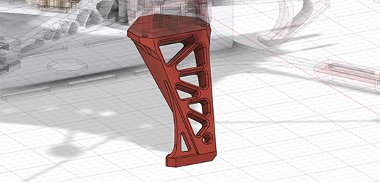

Parts will be list for 2 versions, some parts can be shared across vesions
The main difference between these 2 versions are how HD cameras being mounted.

V1 makes everything simple and is easy for maintenance, camera angle ranges form 0 to 30, but it lacks style.
V2 is more stylized, but the printable part are all  weirdly shaped, making 3d printing them not a easy task, Some printable parts even have to take structure load. But hey, at least it looks good, right?

Due to compact design of the frame, both version don't have a big space for HD camera. So compact cinema cameras are suggested, for bigger camera like FX6 or Red komodo, **they will fit**, but watch out for **Vibration absorbing saturation** and **Prop Striking**

### FrameParts
#### shared parts
shared parts including all the base frame and landing gears
**list:**
(*part name* x *copies needed*)
**Carbon Fiber Plate**
- Arm x 8
  - 
- MotorMountPlate x 8
  - 
- BasePlate x 1
  - 
- TopPlate x 1
  - 

*optional:*
- BatteryLandingGear x 1
  - 

**Printable Parts**
- TM_xt90 x 1
  - 
- TM_Topcover x 1
  - 

*optional:*
- BLG_Feet_3PT x 4
  - 
- LG_3DP_Front x 1 
  - 
- LG_3DP_Left x 1
  - 
- LG_3DP_Right x 1
  - 

#### V1 parts
V1 parts including the simple HD Camera mount , frontal DJO O3 camera mount, side m10 GPS and SMA video ant mount.
**list:**
(*part name* x *copies needed*)
**Carbon Fiber Plate**
- CameraDamppedBasePlate x 1
  - 
- CM_MountPlate x 1
  - 
- CM_SupportPlate x 2
  - 
- CMB_SupportPlate x 2
  - 

**Printable Parts**
- CM_3DP_Support01 x 2
  - 
- CM_3DP_Support02 x 2
  - 
- CMB_3DP_Support x 1
  - 
- Hull_01 x 1
  - 
- M10_25mm_SMA x 1
  - 
- TBS_Ant_SMA x 1
  - 
- O3CM_Left x 1
- O3CM_Right x 1
  - 

#### V2 parts
V1 parts is for someone who want unique look
Including a little more aerodynamic HD camera mount, a sick back hull to mount gps, video Ant and two LED shoulders
**list:**
(*part name* x *copies needed*)
**Carbon Fiber Plate**
- CameraDamppedBasePlate02 x 1
  - 
- H02_CameraMountPlate x 1
  - 
- H02_support01 x 2
  - 

**Printable Parts**
- H02_FrontalShell x 1
  - 
- H02_CameraMount x 1
  - 
- H02_BackCover x 1
  - 
- H02_Transparent x 1
  - 
- SH_Mount_L x 1
- SH_Mount_R x 1
  - 
- SH_Transparent_Low_L x 1
- SH_Transparent_Low_R x 1
  - 
- SH_Transparent_Top_L x 1
- SH_Transparent_Top_R x 1
  - 

### Other Important Parts
Only for V2
### bolts
this frame uses m3 and m4 bolt and nuts
- main body
  - m3x18mm stand_offs (outter diameter 5mm) x 20 
  - m3x8mm sunk_head_bolt x 40
  - m3 sunk_head_washer x20
- motor plate
  - m3x8mm stand_offs (outter diameter 5mm) x 16 (12 if using v1.1 motor plate)
  - m3x6mm sun_khead_bolt x 32 (24 if using v1.1 motor plate)
- XT90EM mount
  - m3x16mm sunk_head_bolt x 1
  - m3x25mm sunk_head_bolt x 1
  - m3 self_lock_nut x 2
- XT60EM mount
  - m2.6x6mm sunk_head_bolt x 4
- landing gear
  - m3 self_lock_nut x 5
  - m3x20mm sunk_head_bolt x 4
  - m3x10mm sunk_head_bolt x 9
- back cover mount
  - m3x10mm sunk_head_bolt x 4
  - m3 self_lock_nut x 4
- frontal shell mount
  - m3x20mm sunk_head_bolt x 4
  - m3x40mm sunk_head_bolt x 2
  - m3x12mm sunk_head_bolt x 2
  - m3 self_lock_nut x 8
-frontal shell inner plate mount
  - m3x25mm sunk_head_bolt x 6
  - m3 self_lock_nut x 6
- camera mount hinge
  - m4x22mm bolt x 2
  - m4x85mm bolt x 2
  - m4 self_lock_nut x 3
- camera plate mount
  - m3x8mm sunk_head_bolt x 2
  - m3x12mm sunk_head_bolt x 2
  - m3x35mm sunk_head_bolt x 2
  - m3 self_lock_nut x 6
### motors
- brotherhobby 2812 900kv motor x 8
### miscs
- xt90em x 1
- xt60em x 2
- DJI O3 air unit x 1
- Ipex to SMA 150mm extention cord x2
- LHCP Rush Cherry Long SMA x 2
- Vibration Damping Balls 300g x 6
- MicroAir M10 GPS 25mmx25mmx8mm  x 1
- TBS CRSF Receiver x 1
- flight controller (support 8 motor out) x 1
- 4 in 1 ESC x 2 or * in 1 ESC x 1
- BAT straps 250mm -x 3
### optional
- ws2812 LEDs

